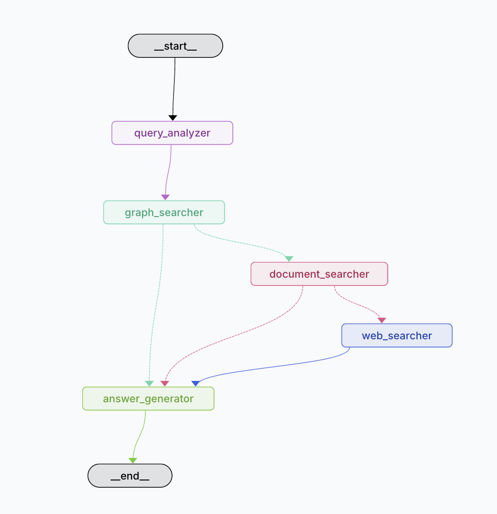
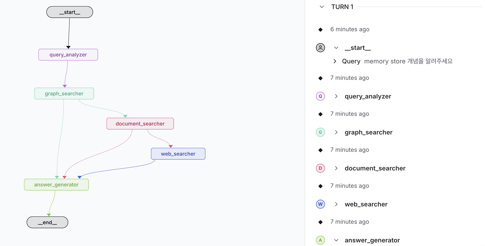

# 발표 자료 영상 (Google Drive)
https://drive.google.com/file/d/1eznk7mxIb5EqQ3jutAw3uxashRSDuUgU/view?usp=sharing


# Personal Knowledge Assistant
## 주제: LangGraph Tutor

---

## 1. 프로젝트 소개


Personal Knowledge Assistant(개인 지식관리 비서) 프로젝트로, 초기 지식 도메인은 LangGraph 로 한정하여 부제는 LangGraphTutor
---

## 2. 주요 기능

### 핵심 기능
다음과 같은 계층적 검색 구조를 '개인화된 지식 우선순위 기반 검색'을 제공합니다

개인 노트 우선 검색 (사용자가 직접 작성한 노트와 메모) -> 공식 문서 검색 (LangGraph 공식 문서 및 레퍼런스) -> 웹 검색

### 시스템 구조
```
Personal Knowledge Assistant : 개인화된 지식 우선순위를 기반으로 자동 통합 검색
내 노트 → 공식 문서 → 검증된 외부 자료 순으로 자동 통합 검색
```

**핵심 가치**: 개인 맞춤형 정보(내부 정보) + 공식/최신 지식 검색(외부 정보)

---

### 데모


