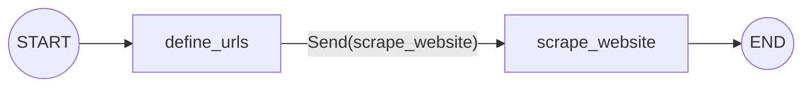

#   LangGraph 활용 - 메시지 그래프 + 리듀서 구현 + 병렬 실행

---

## 환경 설정 및 준비

`(1) Env 환경변수`


```python
from dotenv import load_dotenv
load_dotenv()
```


    True


`(2) 기본 라이브러리`


```python
import os
from glob import glob

from pprint import pprint
import json
```

`(3) Langsmith tracing 설정`


```python
# Langsmith tracing 여부를 확인 (true: langsmith 추척 활성화, false: langsmith 추척 비활성화)
import os
print(os.getenv('LANGSMITH_TRACING'))
```

    true


---

## **Reducer (리듀서)**

- **State Reducer**는 LangGraph의 **상태 관리 핵심 메커니즘**

- 각 노드의 출력을 **전체 그래프 상태에 통합**하는 방식을 정의

- **Reducer의 필요성**:

    - **상태 덮어쓰기 문제**: 기본적으로 각 노드의 반환값은 해당 상태 키의 이전 값을 덮어쓰는 방식으로 동작 (override)
    
    - **누적 업데이트 필요**: 특히 메시지 리스트와 같은 경우, 이전 상태에 새로운 값을 추가하고 싶을 때가 있음 

`(1) Reducer를 별도로 지정하지 않은 경우 `

- **기본 Reducer**는 이전 값을 **자동으로 덮어쓰는** 방식으로 작동
- Reducer 설정이 없는 경우 **자동으로 기본값**이 적용
- 이는 단순한 상태 업데이트에는 적합하나 **데이터 누적이 필요한 경우 부적절**
- 기본 Reducer는 **간단한 상태 관리**에 적합하지만 복잡한 데이터 처리에는 한계가 있음


```python
from typing import TypedDict, List
from langgraph.graph import StateGraph, START, END
from IPython.display import Image, display

# 상태 정의 
class DocumentState(TypedDict):
    query: str
    documents: List[str]

# Node 1: query 업데이트
def node_1(state: DocumentState) -> DocumentState:
    print("---Node 1 (query update)---")
    query = state["query"]
    return {"query": query}

# Node 2: 검색된 문서 추가 
def node_2(state: DocumentState) -> DocumentState:
    print("---Node 2 (add documents)---")
    return {"documents": ["doc1.pdf", "doc2.pdf", "doc3.pdf"]}

# Node 3: 추가적인 문서 검색 결과 추가
def node_3(state: DocumentState) -> DocumentState:
    print("---Node 3 (add more documents)---")
    return {"documents": ["doc2.pdf", "doc4.pdf", "doc5.pdf"]}


# 그래프 빌드
builder = StateGraph(DocumentState)
builder.add_node("node_1", node_1)
builder.add_node("node_2", node_2)
builder.add_node("node_3", node_3)

# 논리 구성
builder.add_edge(START, "node_1")
builder.add_edge("node_1", "node_2")
builder.add_edge("node_2", "node_3")
builder.add_edge("node_3", END)

# 그래프 실행
graph = builder.compile()

# 그래프 시각화
display(Image(graph.get_graph().draw_mermaid_png()))

```


    

    


```python
# 초기 상태
initial_state = {"query": "채식주의자를 위한 비건 음식을 추천해주세요."}

# 그래프 실행 
final_state = graph.invoke(initial_state)

# 최종 상태 출력
print("-"*100)
print("최종 상태:")
print("쿼리:", final_state['query'])
print("검색된 문서:", final_state['documents'])
```

    ---Node 1 (query update)---
    ---Node 2 (add documents)---
    ---Node 3 (add more documents)---
    ----------------------------------------------------------------------------------------------------
    최종 상태:
    쿼리: 채식주의자를 위한 비건 음식을 추천해주세요.
    검색된 문서: ['doc2.pdf', 'doc4.pdf', 'doc5.pdf']


`(2) Reducer를 별도로 지정하는 경우 `

- **Annotated**를 통해 **사용자 정의 Reducer**를 지정할 수 있음 
- **operator.add**를 사용하면 리스트 형태의 데이터를 **누적 관리**할 수 있음 
- 여기서는 기존 리스트에 새로운 메시지를 추가하는 방식으로 작동


```python
from operator import add
from typing import Annotated, TypedDict

class ReducerState(TypedDict):
    query: str
    documents: Annotated[List[str], add]

# Node 1: query 업데이트
def node_1(state: ReducerState) -> ReducerState:
    print("---Node 1 (query update)---")
    query = state["query"]
    return {"query": query}

# Node 2: 검색된 문서 추가 
def node_2(state: ReducerState) -> ReducerState:
    print("---Node 2 (add documents)---")
    return {"documents": ["doc1.pdf", "doc2.pdf", "doc3.pdf"]}

# Node 3: 추가적인 문서 검색 결과 추가
def node_3(state: ReducerState) -> ReducerState:
    print("---Node 3 (add more documents)---")
    return {"documents": ["doc2.pdf", "doc4.pdf", "doc5.pdf"]}

# 그래프 빌드
builder = StateGraph(ReducerState)
builder.add_node("node_1", node_1)
builder.add_node("node_2", node_2)
builder.add_node("node_3", node_3)

# 논리 구성
builder.add_edge(START, "node_1")
builder.add_edge("node_1", "node_2")
builder.add_edge("node_2", "node_3")
builder.add_edge("node_3", END)

# 그래프 실행
graph = builder.compile()

# 그래프 시각화
display(Image(graph.get_graph().draw_mermaid_png()))
```


    

    


```python
# 초기 상태
initial_state = {"query": "채식주의자를 위한 비건 음식을 추천해주세요."}

# 그래프 실행 
final_state = graph.invoke(initial_state)

# 최종 상태 출력
print("-"*100)
print("최종 상태:")
print("쿼리:", final_state['query'])
print("검색된 문서:", final_state['documents'])
```

    ---Node 1 (query update)---
    ---Node 2 (add documents)---
    ---Node 3 (add more documents)---
    ----------------------------------------------------------------------------------------------------
    최종 상태:
    쿼리: 채식주의자를 위한 비건 음식을 추천해주세요.
    검색된 문서: ['doc1.pdf', 'doc2.pdf', 'doc3.pdf', 'doc2.pdf', 'doc4.pdf', 'doc5.pdf']


`(3) Custom Reducer 사용 `

- **Custom Reducer**는 **복잡한 상태 관리**가 필요할 때 사용됨 
- **중복 제거**나 **최대/최소값 유지**와 같은 특수한 로직을 구현할 수 있음 
- 비즈니스 요구사항에 맞는 **맞춤형 상태 관리**가 가능
- 상황에 따라 **조건부 병합**과 같은 고급 기능을 구현할 수 있음 


```python
from typing import TypedDict, List, Annotated

# Custom reducer: 중복된 문서를 제거하며 리스트 병합
def reduce_unique_documents(left: list | None, right: list | None) -> list:
    """Combine two lists of documents, removing duplicates."""
    if not left:
        left = []
    if not right:
        right = []
    # 중복 제거: set을 사용하여 중복된 문서를 제거하고 다시 list로 변환
    return sorted(list(set(left + right)), reverse=True)

# 상태 정의 (documents 필드 포함)
class CustomReducerState(TypedDict):
    query: str
    documents: Annotated[List[str], reduce_unique_documents]  # Custom Reducer 적용
```


```python
# Node 1: query 업데이트
def node_1(state: CustomReducerState) -> CustomReducerState:
    print("---Node 1 (query update)---")
    query = state["query"]
    return {"query": query}

# Node 2: 검색된 문서 추가 
def node_2(state: CustomReducerState) -> CustomReducerState:
    print("---Node 2 (add documents)---")
    return {"documents": ["doc1.pdf", "doc2.pdf", "doc3.pdf"]}

# Node 3: 추가적인 문서 검색 결과 추가
def node_3(state: CustomReducerState) -> CustomReducerState:
    print("---Node 3 (add more documents)---")
    return {"documents": ["doc2.pdf", "doc4.pdf", "doc5.pdf"]}

# 그래프 빌드
builder = StateGraph(CustomReducerState)
builder.add_node("node_1", node_1)
builder.add_node("node_2", node_2)
builder.add_node("node_3", node_3)

# 논리 구성
builder.add_edge(START, "node_1")
builder.add_edge("node_1", "node_2")
builder.add_edge("node_2", "node_3")
builder.add_edge("node_3", END)

# 그래프 실행
graph = builder.compile()

# 그래프 시각화
display(Image(graph.get_graph().draw_mermaid_png()))
```


    

    


```python
# 초기 상태
initial_state = {"query": "채식주의자를 위한 비건 음식을 추천해주세요."}

# 그래프 실행 
final_state = graph.invoke(initial_state)

# 최종 상태 출력
print("-"*100)
print("최종 상태:")
print("쿼리:", final_state['query'])
print("검색된 문서:", final_state['documents'])
```

    ---Node 1 (query update)---
    ---Node 2 (add documents)---
    ---Node 3 (add more documents)---
    ----------------------------------------------------------------------------------------------------
    최종 상태:
    쿼리: 채식주의자를 위한 비건 음식을 추천해주세요.
    검색된 문서: ['doc5.pdf', 'doc4.pdf', 'doc3.pdf', 'doc2.pdf', 'doc1.pdf']


---

## **Message 사용**

- **LangGraph**는 **메시지 목록** 기반의 채팅 모델 인터페이스를 활용

- `HumanMessage`와 `AIMessage` 등 다양한 메시지 타입을 지원

- 그래프 상태에서 대화 기록은 **메시지 객체 리스트**로 저장되며, 이를 통해 효율적인 대화 관리를 가능

- **reducer 함수**를 통해 상태 업데이트 시 메시지 목록이 어떻게 갱신될지 정의할 수 있음 

`(1) operator.add`

- 메시지 목록에 새로운 메시지를 간단히 추가하는 기본적인 reducer 함수
    1. `messages` 키가 메시지 리스트를 저장
    2. `add` reducer가 새 메시지를 기존 리스트에 추가
    3. 모든 종류의 메시지(`HumanMessage`, `AIMessage` 등)가 허용됨

- 주의사항:
    - `operator.add`는 단순히 리스트를 연결
    - 중복 메시지도 추가됨
    - 메시지 삭제나 수정은 불가능


```python
from langchain_core.messages import AnyMessage
from langgraph.graph.message import add_messages
from typing import Annotated
from typing_extensions import TypedDict
from langchain_openai import ChatOpenAI
from operator import add

# 상태 정의
class GraphState(TypedDict):
    messages: Annotated[list[AnyMessage], add]

# LLM 인스턴스 생성
llm = ChatOpenAI(model="gpt-4.1-mini")

# chatbot 노드 함수 정의
def chatbot(state: GraphState) -> GraphState:
    # LLM을 사용하여 챗봇 메시지 생성
    return {"messages": [llm.invoke(state["messages"])]}
```


```python
# Workflow Graph
builder = StateGraph(GraphState)

builder.add_node("chatbot", chatbot)

builder.add_edge(START, "chatbot")
builder.add_edge("chatbot", END)

# 그래프 컴파일
graph = builder.compile()

# 초기 상태
initial_state = {"messages": [("user", "안녕하세요!")]}

# 그래프 실행
for event in graph.stream(initial_state, stream_mode="values"):
    pprint(event['messages'])
    print("-"*100)
```

    [('user', '안녕하세요!')]
    ----------------------------------------------------------------------------------------------------
    [('user', '안녕하세요!'),
     AIMessage(content='안녕하세요! 어떻게 도와드릴까요?', additional_kwargs={'refusal': None}, response_metadata={'token_usage': {'completion_tokens': 10, 'prompt_tokens': 10, 'total_tokens': 20, 'completion_tokens_details': {'accepted_prediction_tokens': 0, 'audio_tokens': 0, 'reasoning_tokens': 0, 'rejected_prediction_tokens': 0}, 'prompt_tokens_details': {'audio_tokens': 0, 'cached_tokens': 0}}, 'model_name': 'gpt-4.1-mini-2025-04-14', 'system_fingerprint': None, 'id': 'chatcmpl-Bt82yISwIZ1hAc9mDBrSQdMlEif0q', 'service_tier': 'default', 'finish_reason': 'stop', 'logprobs': None}, id='run--1008652c-789e-42f1-bd68-bf95dab85402-0', usage_metadata={'input_tokens': 10, 'output_tokens': 10, 'total_tokens': 20, 'input_token_details': {'audio': 0, 'cache_read': 0}, 'output_token_details': {'audio': 0, 'reasoning': 0}})]
    ----------------------------------------------------------------------------------------------------


`(2) add_messages`

- 메시지 ID를 기반으로 기존 메시지를 업데이트하거나 새 메시지를 추가하는 고급 관리 기능을 제공
    - 새 메시지는 기존 목록에 추가
    - 기존 메시지 업데이트도 올바르게 처리 (메시지 ID를 추적)

- 기존 메시지의 중복 추가를 방지


```python
from typing import Annotated
from langchain_core.messages import AnyMessage
from langgraph.graph.message import add_messages

# add_messages 사용 상태 정의
class GraphState(TypedDict):
    messages: Annotated[list[AnyMessage], add_messages]

# LLM 인스턴스 생성
llm = ChatOpenAI(model="gpt-4.1-mini")

# chatbot 노드 함수 정의
def chatbot(state: GraphState) -> GraphState:
    # LLM을 사용하여 챗봇 메시지 생성
    return {"messages": [llm.invoke(state["messages"])]}

# Workflow Graph
builder = StateGraph(GraphState)

builder.add_node("chatbot", chatbot)

builder.add_edge(START, "chatbot")
builder.add_edge("chatbot", END)

# 그래프 컴파일
graph = builder.compile()

# 초기 상태
initial_state = {"messages": [("user", "안녕하세요!")]}

# 그래프 실행
for event in graph.stream(initial_state, stream_mode="values"):
    pprint(event['messages'])
    print("-"*100)
```

    [HumanMessage(content='안녕하세요!', additional_kwargs={}, response_metadata={}, id='e7c5b44d-4ad6-4c88-b133-9c3ebeb4dffb')]
    ----------------------------------------------------------------------------------------------------
    [HumanMessage(content='안녕하세요!', additional_kwargs={}, response_metadata={}, id='e7c5b44d-4ad6-4c88-b133-9c3ebeb4dffb'),
     AIMessage(content='안녕하세요! 무엇을 도와드릴까요?', additional_kwargs={'refusal': None}, response_metadata={'token_usage': {'completion_tokens': 11, 'prompt_tokens': 10, 'total_tokens': 21, 'completion_tokens_details': {'accepted_prediction_tokens': 0, 'audio_tokens': 0, 'reasoning_tokens': 0, 'rejected_prediction_tokens': 0}, 'prompt_tokens_details': {'audio_tokens': 0, 'cached_tokens': 0}}, 'model_name': 'gpt-4.1-mini-2025-04-14', 'system_fingerprint': None, 'id': 'chatcmpl-Bt840rbHVx4C5zrCQVzCG7qeFYKet', 'service_tier': 'default', 'finish_reason': 'stop', 'logprobs': None}, id='run--8c1e63fd-3661-4dd1-a217-6719d659775a-0', usage_metadata={'input_tokens': 10, 'output_tokens': 11, 'total_tokens': 21, 'input_token_details': {'audio': 0, 'cache_read': 0}, 'output_token_details': {'audio': 0, 'reasoning': 0}})]
    ----------------------------------------------------------------------------------------------------


`(3) MessagesState`

- **`MessagesState`** 는 메시지 관리를 위해 미리 정의된 상태 타입

- 이 상태는 **`add_messages` reducer**를 기본으로 사용하여 메시지 업데이트를 자동으로 처리

- `AnyMessage` 객체 리스트를 포함하는 **단일 `messages` 키**로 구성되어 있어 구조가 단순함 


```python
from langgraph.graph import MessagesState

# messages 키를 가진 상태 생성 (messages 키는 기본 제공)
class GraphState(MessagesState):  # MessagesState 상속
    ... 
    # 추가적인 필드 정의 가능
    # custom_field: str

# LLM 인스턴스 생성
llm = ChatOpenAI(model="gpt-4.1-mini")

# chatbot 노드 함수 정의
def chatbot(state: GraphState) -> GraphState:
    # LLM을 사용하여 챗봇 메시지 생성
    return {"messages": [llm.invoke(state["messages"])]}

# Workflow Graph
builder = StateGraph(GraphState)

builder.add_node("chatbot", chatbot)

builder.add_edge(START, "chatbot")
builder.add_edge("chatbot", END)

# 그래프 컴파일
graph = builder.compile()

# 초기 상태
initial_state = {"messages": [("user", "안녕하세요!")]}

# 그래프 실행
for event in graph.stream(initial_state, stream_mode="values"):
    pprint(event['messages'])
    print("-"*100)
```

    [HumanMessage(content='안녕하세요!', additional_kwargs={}, response_metadata={}, id='dbdfcef1-ddd8-4592-8ece-3d0e68681a15')]
    ----------------------------------------------------------------------------------------------------
    [HumanMessage(content='안녕하세요!', additional_kwargs={}, response_metadata={}, id='dbdfcef1-ddd8-4592-8ece-3d0e68681a15'),
     AIMessage(content='안녕하세요! 무엇을 도와드릴까요?', additional_kwargs={'refusal': None}, response_metadata={'token_usage': {'completion_tokens': 11, 'prompt_tokens': 10, 'total_tokens': 21, 'completion_tokens_details': {'accepted_prediction_tokens': 0, 'audio_tokens': 0, 'reasoning_tokens': 0, 'rejected_prediction_tokens': 0}, 'prompt_tokens_details': {'audio_tokens': 0, 'cached_tokens': 0}}, 'model_name': 'gpt-4.1-mini-2025-04-14', 'system_fingerprint': 'fp_658b958c37', 'id': 'chatcmpl-Bt87OZbvUTvQA4qZt94WWIRP2bNTj', 'service_tier': 'default', 'finish_reason': 'stop', 'logprobs': None}, id='run--72defe06-c2f3-48ea-9c3a-d0353f0f6458-0', usage_metadata={'input_tokens': 10, 'output_tokens': 11, 'total_tokens': 21, 'input_token_details': {'audio': 0, 'cache_read': 0}, 'output_token_details': {'audio': 0, 'reasoning': 0}})]
    ----------------------------------------------------------------------------------------------------


`(4) MessagesState 커스텀 필드 추가`

- **MessagesState**를 상속받아 추가 필드를 포함하는 새로운 상태 타입을 정의할 수 있음 

- 기존 `messages` 키의 **`add_messages` reducer** 기능을 그대로 유지


```python
from typing import Optional
from langgraph.graph import StateGraph, START, END, MessagesState
from langchain_openai import ChatOpenAI

# MessagesState를 상속하여 커스텀 필드 추가
class GraphState(MessagesState):
    # 사용자의 감정 상태를 추적하는 필드 추가
    emotion: Optional[str] 

# LLM 인스턴스 생성
llm = ChatOpenAI(model="gpt-4.1-mini")

# 감정 분석을 위한 프롬프트 템플릿
EMOTION_PROMPT = """
사용자의 메시지를 분석하여 감정 상태를 파악해주세요.
가능한 감정 상태: 행복, 슬픔, 화남, 중립

사용자 메시지: {message}

감정 상태만 한 단어로 답변해주세요.
"""

# 감정 분석 노드
def analyze_emotion(state: GraphState) -> GraphState:
    # 가장 최근 사용자 메시지 가져오기
    last_message = state["messages"][-1].content
    
    # 감정 분석 실행
    emotion_analysis = llm.invoke(EMOTION_PROMPT.format(message=last_message))
    
    # 상태 업데이트
    return {
        "emotion": emotion_analysis.content.strip()
    }

# 챗봇 응답 노드
def chatbot(state: GraphState) -> GraphState:
    # 현재 감정 상태를 고려한 시스템 메시지 생성
    system_message = f"""
    사용자의 현재 감정 상태는 {state['emotion']}입니다.
    이를 고려하여 공감적이고 적절한 응답을 해주세요.
    """
    
    # 기존 메시지에 시스템 메시지 추가
    messages = [{"role": "system", "content": system_message}] + state["messages"]
    
    # LLM 응답 생성
    response = llm.invoke(messages)
    
    return {"messages": [response]}

# Workflow Graph 구성
builder = StateGraph(GraphState)

# 노드 추가
builder.add_node("analyze_emotion", analyze_emotion)
builder.add_node("chatbot", chatbot)

# 엣지 추가
builder.add_edge(START, "analyze_emotion")
builder.add_edge("analyze_emotion", "chatbot")
builder.add_edge("chatbot", END)

# 그래프 컴파일
graph = builder.compile()

# 그래프 시각화
display(Image(graph.get_graph().draw_mermaid_png()))
```


    

    


```python
# 초기 상태
initial_state = {
    "messages": [{"role": "user", "content": "오늘 정말 힘든 하루였어요..."}]
}

# 그래프 실행
for event in graph.stream(initial_state, stream_mode="values"):
    if "emotion" in event:
        print(f"감정 상태: {event['emotion']}")
    if "messages" in event:
        print("메시지:")
        for msg in event["messages"]:
            print(f"{msg.type}: {msg.content}")
    print("-"*100)
```

    메시지:
    human: 오늘 정말 힘든 하루였어요...
    ----------------------------------------------------------------------------------------------------
    감정 상태: 슬픔
    메시지:
    human: 오늘 정말 힘든 하루였어요...
    ----------------------------------------------------------------------------------------------------
    감정 상태: 슬픔
    메시지:
    human: 오늘 정말 힘든 하루였어요...
    ai: 정말 많이 힘드셨겠어요. 그런 날에는 마음이 무거워지기도 하고, 지친 기분이 드는 게 당연해요. 무슨 일 있었는지 이야기해도 괜찮아요. 여기서 편하게 얘기해 주세요. 당신의 감정을 이해하고 함께 공감하고 싶어요.
    ----------------------------------------------------------------------------------------------------


---

## **병렬 처리**

- **분기(branching)** 기능을 통해 LangGraph에서 노드의 병렬 실행이 가능

- 병렬 처리는 **독립적인 작업**들을 동시에 실행함으로써 전체 처리 시간을 단축

- 다양한 데이터 소스에서 **정보 수집 및 처리**가 필요한 경우 병렬 실행이 특히 효과적

`(1) 표준 엣지를 사용한 분기 (Fan-out/Fan-in)`

- **Fan-out** 구조는 하나의 노드에서 여러 병렬 노드로 데이터를 분산시키는 방식을 구현

- **Fan-in** 구조는 병렬로 처리된 여러 노드의 결과를 단일 노드에서 취합하는 역할

- 가장 기본적이고 직관적인 병렬 처리 구조


```python
# 여러 검색 엔진에서 정보 가져오기

import operator
from typing import Annotated, Any, TypedDict
from langgraph.graph import StateGraph, START, END

# 상태 정의: 검색 결과를 누적할 리스트를 포함
class SearchState(TypedDict):
    search_results: Annotated[list, operator.add]

# 각 검색 엔진에 대한 노드 정의
def search_engine_a(state: SearchState):
    print("Searching with Engine A...")
    return {"search_results": ["Result A1", "Result A2"]}

def search_engine_b(state: SearchState):
    print("Searching with Engine B...")
    return {"search_results": ["Result B1"]}

def combine_results(state: SearchState):
    print("Combining search results...")
    return {"search_results": ["Combined Result"]}

# 그래프 구성
search_builder = StateGraph(SearchState)
search_builder.add_node("engine_a", search_engine_a)
search_builder.add_node("engine_b", search_engine_b)
search_builder.add_node("combine", combine_results)

# 엣지 연결: START -> engine_a, engine_b (병렬 실행) -> combine -> END
search_builder.add_edge(START, "engine_a")
search_builder.add_edge(START, "engine_b")
# search_builder.add_edge("engine_a", "combine")
# search_builder.add_edge("engine_b", "combine")
search_builder.add_edge(["engine_a", "engine_b"], "combine") # 병렬 실행 후 결과 결합
search_builder.add_edge("combine", END)

# 그래프 컴파일
search_graph = search_builder.compile()

# 그래프 시각화
display(Image(search_graph.get_graph().draw_mermaid_png()))
```


    

    


```python
# 그래프 실행
search_graph.invoke({"search_results": []})
```

    Searching with Engine A...
    Searching with Engine B...
    Combining search results...


    {'search_results': ['Result A1', 'Result A2', 'Result B1', 'Combined Result']}


`(2) 조건부 엣지를 사용한 분기 (Conditional Branching)`

- **Fan-out** 구조는 하나의 노드에서 여러 병렬 노드로 데이터를 분산시키는 방식을 구현

- **Fan-in** 구조는 병렬로 처리된 여러 노드의 결과를 단일 노드에서 취합하는 역할

- 가장 기본적이고 직관적인 병렬 처리 구조

**구현 예시**

- 초기 그리팅 후 조건부로 서비스를 실행
- 선택된 서비스들을 병렬로 실행
- 모든 서비스 실행 후 최종 처리를 수행
- 전체 과정의 상태를 추적


```python
import operator
from typing import Annotated, Sequence, TypedDict
from langgraph.graph import StateGraph, START, END

# 상태 정의: aggregate 리스트와 라우팅을 위한 user_intent 필드 포함
class ChatState(TypedDict):
    messages: Annotated[list, operator.add]  # aggregate 대신 messages 사용
    user_intent: str  # 라우팅 조건

# 서비스 노드 정의
def greet_service(state: ChatState):
    print(f'Adding "greet" to {state["messages"]}')
    return {"messages": ["Hello!"]} 

def weather_service(state: ChatState):
    print(f'Adding "weather" to {state["messages"]}')
    return {"messages": ["The weather is sunny."]}

def news_service(state: ChatState):
    print(f'Adding "news" to {state["messages"]}')
    return {"messages": ["Here's the latest news."]}

def help_service(state: ChatState):
    print(f'Adding "help" to {state["messages"]}')
    return {"messages": ["How can I help you?"]}

def process_response(state: ChatState):
    print(f'Adding "process" to {state["messages"]}')
    return {"messages": ["Processing complete."]}

# 라우팅 함수: user_intent 값에 따라 서비스 노드 결정
def route_services(state: ChatState) -> Sequence[str]:
    if state["user_intent"] == "weather_news":
        # 날씨와 뉴스 서비스를 병렬 실행
        return ["weather_service", "news_service"]
    
    # 기본적으로 인사와 뉴스 서비스를 병렬 실행
    return ["help_service", "news_service"]

# 그래프 구성
chat_builder = StateGraph(ChatState)

# 노드 추가
chat_builder.add_node("greet", greet_service)
chat_builder.add_node("weather_service", weather_service)
chat_builder.add_node("news_service", news_service)
chat_builder.add_node("help_service", help_service)
chat_builder.add_node("process", process_response)

# 엣지 추가
chat_builder.add_edge(START, "greet")

# 중간 노드 정의
intermediates = ["weather_service", "news_service", "help_service"]

# greet 노드에서 조건부 엣지 추가
chat_builder.add_conditional_edges(
    "greet",
    route_services,
    intermediates,
)

# 중간 노드들을 process 노드에 연결
for node in intermediates:
    chat_builder.add_edge(node, "process")

chat_builder.add_edge("process", END)

# 그래프 컴파일
chat_graph = chat_builder.compile()

# 그래프 시각화
display(Image(chat_graph.get_graph().draw_mermaid_png()))
```


    

    


```python
# "weather_news" 의도를 가지고 실행
chat_graph.invoke({"messages": [], "user_intent": "weather_news"})
```

    Adding "greet" to []
    Adding "news" to ['Hello!']
    Adding "weather" to ['Hello!']
    Adding "process" to ['Hello!', "Here's the latest news.", 'The weather is sunny.']


    {'messages': ['Hello!',
      "Here's the latest news.",
      'The weather is sunny.',
      'Processing complete.'],
     'user_intent': 'weather_news'}


```python
# 다른 의도를 가지고 실행
chat_graph.invoke({"messages": [], "user_intent": "news"})
```

    Adding "greet" to []
    Adding "help" to ['Hello!']
    Adding "news" to ['Hello!']
    Adding "process" to ['Hello!', 'How can I help you?', "Here's the latest news."]


    {'messages': ['Hello!',
      'How can I help you?',
      "Here's the latest news.",
      'Processing complete.'],
     'user_intent': 'news'}


`(3) 다단계 분기 (Multi-step Parallel Paths)`

- **다단계 분기**는 각각의 병렬 경로에서 여러 단계의 독립적인 처리를 지원 

- 각 분기는 **서로 다른 데이터 처리 파이프라인**을 포함할 수 있어, 복잡한 워크플로우 구현이 가능

- 최종적으로 각 분기의 결과는 하나의 노드에서 **통합되어 처리**될 수 있음 


```python
# 데이터 전처리와 모델 예측을 병렬로 수행하기

import operator
from typing import Annotated, TypedDict
from langgraph.graph import StateGraph, START, END

class ModelState(TypedDict):
    data: Annotated[list, operator.add]

def fetch_data_a(state: ModelState):
    return {"data": ["Data A1"]}

def preprocess_data_a(state: ModelState):
    return {"data": ["Preprocessed A1"]}

def fetch_data_b(state: ModelState):
    return {"data": ["Data B1"]}

def make_prediction(state: ModelState):
    return {"data": ["Prediction from A and B"]}

model_builder = StateGraph(ModelState)
model_builder.add_node("fetch_a", fetch_data_a)
model_builder.add_node("preprocess_a", preprocess_data_a)
model_builder.add_node("fetch_b", fetch_data_b)
model_builder.add_node("predict", make_prediction)

model_builder.add_edge(START, "fetch_a")
model_builder.add_edge(START, "fetch_b")
model_builder.add_edge("fetch_a", "preprocess_a")
model_builder.add_edge(["preprocess_a", "fetch_b"], "predict")
model_builder.add_edge("predict", END)

model_graph = model_builder.compile()

display(Image(model_graph.get_graph().draw_mermaid_png()))
```


    

    


```python
# 그래프 실행
model_graph.invoke({"data": []})
```


    {'data': ['Data A1', 'Data B1', 'Preprocessed A1', 'Prediction from A and B']}


`(4) 동적 엣지 생성 및 개별 상태 전달하기 (Map-Reduce 패턴)`

- **기본 동작의 한계**

    - 기본적으로 LangGraph의 노드와 엣지는 미리 정의되며, 모든 노드는 동일한 공유 상태(shared state)를 사용함. 하지만 다음과 같은 경우에는 문제가 발생할 수 있음. 

    -  **동적 엣지:** 실행 시점에 따라 연결해야 할 노드의 수가 달라지는 경우 (예: 입력 데이터에 따라 다른 개수의 하위 작업을 생성해야 하는 경우)
    -  **개별 상태:** 각 노드가 독립적인 상태를 가지고 작업해야 하는 경우 (예: 각 하위 작업이 서로 다른 데이터를 처리해야 하는 경우)

- **Map-Reduce 패턴**

    1.  **Map:**  하나의 노드(mapper)가 여러 개의 객체(또는 작업)를 생성
    2.  **Reduce:** 다른 노드(reducer)가 mapper가 생성한 객체들을 처리하고 결과를 결합

-  **`Send` 객체**

    - LangGraph에서는 `Send` 객체를 사용하여 map 단계를 구현할 수 있음 
    - `Send` 객체는 조건부 엣지(`add_conditional_edges`)의 `condition_function`에서 반환될 수 있으며, 다음과 같은 두 가지 인수를 받아서 구현

        1.  **`node_name` (str):**  실행할 노드의 이름
        2.  **`state` (dict):** 해당 노드에 전달할 개별 상태


```python
import operator
from typing import Annotated, List, TypedDict
from langgraph.graph import StateGraph, START, END
from langgraph.types import Send
from IPython.display import Image, display

# 글로벌 상태 정의
class WebScrapingState(TypedDict):
    urls: List[str]  # 스크래핑할 URL 목록 (글로벌)
    scraped_data: Annotated[List[str], operator.add]  # 스크래핑된 데이터 (글로벌, 누적)

# 로컬 상태 정의
class PrivateSate(TypedDict):
    url: str  # 스크래핑할 URL (로컬 상태)

# 노드 정의
def define_urls(state: WebScrapingState):
    """URL 목록을 정의합니다. (글로벌 상태 사용)"""
    print("Using provided URLs...")
    return {"urls": state["urls"]}  # 글로벌 상태(urls) 사용

def scrape_website(state: PrivateSate):  # 로컬 상태를 받음
    """각 웹사이트를 스크래핑합니다. (로컬 상태 사용)"""
    print(f"Scraping {state['url']}...")  # 로컬 상태(url) 사용
    # 실제 스크래핑 로직 (여기서는 시뮬레이션)
    return {"scraped_data": [f"Data from {state['url']}"]} # 글로벌 상태(scraped_data) 사용

def route_to_scraping(state: WebScrapingState):
    """스크래핑 노드로 라우팅합니다. (글로벌 상태 사용, 로컬 상태 생성)"""
    # 글로벌 상태(urls)를 사용하여 로컬 상태({"url": url})를 생성하고 Send로 전달
    return [Send("scrape_website", {"url": url}) for url in state["urls"]]


# 그래프 구성
graph = StateGraph(WebScrapingState)  
graph.add_node("define_urls", define_urls)
graph.add_node("scrape_website", scrape_website)

graph.set_entry_point("define_urls")

graph.add_conditional_edges(
    "define_urls",
    route_to_scraping,
    ["scrape_website"],  # 스크래핑 노드로 라우팅
)

graph.add_edge("scrape_website", END)

# 그래프 컴파일
compiled_graph = graph.compile()

# 그래프 시각화
display(Image(compiled_graph.get_graph().draw_mermaid_png()))  
```


    

    


```python
# 그래프 실행 (외부에서 URL 목록 입력)
initial_state = {"urls": ["https://example.com", "https://example.net", "https://example.org"]}
result = compiled_graph.invoke(initial_state)
```

    Using provided URLs...
    Scraping https://example.com...
    Scraping https://example.net...
    Scraping https://example.org...





```python
pprint(result)
```

    {'scraped_data': ['Data from https://example.com',
                      'Data from https://example.net',
                      'Data from https://example.org'],
     'urls': ['https://example.com', 'https://example.net', 'https://example.org']}


### **`Send` 객체의 사용 예시**

`(1) 문서 요약 시스템 (대용량 텍스트 처리)`
- 긴 문서를 여러 부분으로 나누어 병렬로 요약한 후 통합하는 시스템


```python
import operator
from typing import Annotated, List, Dict, Tuple, Any
from typing_extensions import TypedDict
from langchain_core.documents import Document
from langgraph.types import Send
from langgraph.graph import END, START, StateGraph
from langchain_openai import ChatOpenAI  
from IPython.display import Image, display

# LLM 모델 초기화
model = ChatOpenAI(model="gpt-4.1-mini", temperature=0)

class SummarizationState(TypedDict):
    contents: List[Document]  # 초기 Document 객체 리스트
    chunks: List[Dict[str, Any]]  # 청크 리스트 (인덱스, 내용, 메타데이터 포함)
    summaries: Annotated[List[Tuple[int, str]], operator.add]  # (인덱스, 요약) 튜플 리스트
    final_summary: str

class DocumentState(TypedDict):
    content: str
    index: int  # 청크의 순서를 나타내는 인덱스

def split_documents(state: SummarizationState):
    """각 Document를 순서를 유지하며 청크로 분할"""
    chunks = []
    chunk_size = 1000
    global_chunk_index = 0
    
    # 각 Document를 순차적으로 처리
    for doc_index, document in enumerate(state["contents"]):
        content = document.page_content
        
        # 해당 문서를 청크로 분할
        for i in range(0, len(content), chunk_size):
            chunk_content = content[i:i + chunk_size]
            
            # 빈 청크는 스킵
            if chunk_content.strip():
                chunks.append({
                    "index": global_chunk_index,
                    "content": chunk_content,
                    "source_document": doc_index,
                    "source_metadata": document.metadata
                })
                global_chunk_index += 1
    
    return {"chunks": chunks}

def summarize_document(state: DocumentState):
    """개별 문서 청크를 요약"""
    prompt = f"""다음 텍스트를 2-3문장으로 간결하게 요약해주세요:
    
    {state['content']}
    """
    
    try:
        response = model.invoke(prompt)
        summary = response.content
    except Exception as e:
        summary = f"요약 생성 중 오류 발생: {str(e)}"
    
    # 순서 정보와 함께 요약 반환
    return {"summaries": [(state["index"], summary)]}

def continue_to_summarization(state: SummarizationState):
    """각 청크를 병렬로 요약하도록 Send 작업 생성"""
    return [
        Send("summarize_document", {
            "content": chunk["content"],
            "index": chunk["index"]
        }) 
        for chunk in state["chunks"]
    ]

def create_final_summary(state: SummarizationState):
    """순서를 유지하며 최종 요약 생성"""
    # 인덱스별로 요약을 정렬
    sorted_summaries = sorted(state["summaries"], key=lambda x: x[0])
    
    # 순서대로 요약들을 결합
    ordered_summaries = [summary for _, summary in sorted_summaries]
    combined_summaries = "\n\n".join(ordered_summaries)
    
    prompt = f"""다음은 문서를 청크별로 요약한 내용들입니다. 
    이들을 종합하여 하나의 포괄적이고 일관성 있는 최종 요약을 작성해주세요.
    원본 문서의 순서와 흐름을 유지하면서 핵심 내용을 간결하게 정리해주세요:
    
    {combined_summaries}
    
    최종 요약:
    """
    
    try:
        response = model.invoke(prompt)
        final_summary = response.content
    except Exception as e:
        final_summary = f"최종 요약 생성 중 오류 발생: {str(e)}"
    
    return {"final_summary": final_summary}

# 그래프 구성
builder = StateGraph(SummarizationState)
builder.add_node("split_documents", split_documents)
builder.add_node("summarize_document", summarize_document)
builder.add_node("create_final_summary", create_final_summary)

# 엣지 연결
builder.add_edge(START, "split_documents")
builder.add_conditional_edges("split_documents", continue_to_summarization, ["summarize_document"])
builder.add_edge("summarize_document", "create_final_summary")
builder.add_edge("create_final_summary", END)

# 그래프 컴파일
graph = builder.compile()

# 그래프 시각화
display(Image(graph.get_graph().draw_mermaid_png()))
```


    

    


```python
from langchain_community.document_loaders import PyPDFLoader

loader = PyPDFLoader("data/labor_law.pdf")
documents = loader.load()

print(f"로드된 페이지 수: {len(documents)}")
```

    로드된 페이지 수: 20


```python
# PDF 문서 요약 실행
initial_state = {
    "contents": documents,
}
    
for step in graph.stream(initial_state, stream_mode="values"):
    if "chunks" in step:
        print(f"처리 중인 청크 수: {len(step['chunks'])}")
    if "summaries" in step:
        print(f"현재까지 생성된 요약 수: {len(step['summaries'])}")
    if "final_summary" in step:
        print("최종 요약 생성 중...")
        print(step["final_summary"])  # 최종 요약 출력
    print("-"*100)
```

    현재까지 생성된 요약 수: 0
    ----------------------------------------------------------------------------------------------------
    처리 중인 청크 수: 48
    현재까지 생성된 요약 수: 0
    ----------------------------------------------------------------------------------------------------
    처리 중인 청크 수: 48
    현재까지 생성된 요약 수: 48
    ----------------------------------------------------------------------------------------------------
    처리 중인 청크 수: 48
    현재까지 생성된 요약 수: 48
    최종 요약 생성 중...
    근로기준법은 근로자의 기본적 생활 보장과 국민경제의 균형 발전을 목적으로 하며, 근로자와 사용자의 권리와 의무, 근로계약, 임금, 근로시간, 휴가, 해고, 재해보상, 직장 내 괴롭힘 예방 등 근로조건의 최저기준을 규정한다. 이 법은 근로조건이 근로자와 사용자가 동등한 지위에서 자유롭게 결정되어야 하며, 차별과 강제노동을 금지하고, 근로계약과 단체협약을 성실히 준수할 의무를 사용자에게 부과한다.
    
    근로계약은 법정 기준에 미치지 못하는 조건은 무효이며, 임금, 근로시간, 휴일, 연차유급휴가 등 주요 근로조건을 서면 또는 전자문서로 명확히 명시해야 한다. 사용자는 임금 구성과 계산방법을 근로자에게 교부하고, 변경 시에도 이를 제공해야 하며, 단시간근로자의 근로조건은 통상 근로자의 비율에 따라 결정된다. 강제 저축 계약 체결과 부당한 해고, 징계는 금지되며, 해고 시에는 30일 전 예고 또는 30일분 임금 지급과 서면 통지가 의무화되어 있다.
    
    해고와 관련해 일정 규모 이상의 해고는 고용노동부장관에게 신고해야 하며, 부당해고 시 근로자는 노동위원회에 구제신청할 수 있다. 노동위원회는 신속한 조사와 구제명령을 통해 원직복직 또는 임금 상당액 지급을 명할 수 있고, 이행하지 않을 경우 최대 3천만 원의 이행강제금이 부과된다. 임금은 매월 1회 이상 정해진 날짜에 통화로 전액 직접 지급해야 하며, 체불 사업주는 명단 공개 대상이 될 수 있다.
    
    임금 지급 우선순위는 최종 3개월분 임금과 재해보상금이 다른 채권보다 우선하며, 도급 사업에서 하수급인의 임금 미지급 시 원수급인과 직상 수급인이 연대 책임을 진다. 사용자는 임금대장과 명세서를 작성·교부하고, 임금채권 소멸시효는 3년이다.
    
    근로시간은 1주 40시간, 1일 8시간을 초과할 수 없으며, 탄력적 근로시간제와 선택적 근로시간제를 도입해 일정 조건 하에 근로시간 조정이 가능하다. 근로일 사이 최소 11시간 휴식 보장, 연장근로 시 가산임금 지급, 휴게시간 제공, 주당 평균 1회 이상의 유급휴일 보장 등이 규정되어 있다. 15세 이상 18세 미만 근로자와 임신 중인 여성은 일부 규정에서 제외되며, 야간 및 휴일 근로가 원칙적으로 금지된다.
    
    연차 유급휴가는 1년간 80% 이상 출근한 근로자에게 15일 이상 부여하며, 3년 이상 근속 시 최대 25일까지 추가 휴가를 허용한다. 휴가 사용 촉진 의무와 휴가 시기 조정, 미사용 휴가 소멸 규정도 포함된다. 특정 업종과 근로자에 대해서는 일부 근로시간 및 휴일 규정이 적용되지 않는다.
    
    15세 미만(중학교 재학 중인 18세 미만 포함)은 원칙적으로 근로 불가하나, 취직인허증이 있으면 예외이며, 임산부와 18세 미만자는 유해·위험 사업에 종사할 수 없다. 이들의 근로시간은 하루 7시간, 주 35시간을 초과할 수 없고, 야간·휴일 근로가 제한된다.
    
    여성 근로자 보호를 위해 생리휴가, 출산전후휴가(최대 120일), 유산·사산 휴가, 임신 초기·말기 근로시간 단축, 건강진단 및 수유시간 보장 등이 규정되어 있으며, 임금 삭감은 금지된다.
    
    직장 내 괴롭힘 금지 조항이 신설되어 사용자는 신속한 조사와 피해자 보호, 가해자 징계 등 조치를 취해야 하며, 비밀 누설 금지와 피해자 보호를 위한 근무 장소 변경, 유급휴가 제공 의무가 있다.
    
    업무상 부상·질병에 대해서는 요양비, 휴업보상, 장해보상, 유족보상 등이 규정되어 있으며, 보상 청구권은 퇴직 후에도 유지되고 양도·압류가 불가능하다. 보상 관련 분쟁은 고용노동부장관이나 노동위원회에 심사·중재를 청구할 수 있다.
    
    근로감독관은 고용노동부 소속으로 사업장 조사, 서류 제출 요구, 질병 의심 근로자 검진, 노동법 위반 수사 권한을 가지며, 법 위반 신고자 보호와 위반 시 형사처벌 및 과태료 부과 규정을 집행한다. 사용자는 취업규칙 작성·변경 시 근로자 과반수 의견 청취 및 동의를 받아야 하며, 불리한 변경은 무효다. 기숙사 규칙도 근로자 대표 동의를 필요로 하며, 사생활과 자치권을 보호한다.
    
    임금 체불, 해고, 직장 내 괴롭힘 등 법 위반 시에는 징역, 벌금, 과태료가 부과되며, 노동위원회와 근로감독관의 조사·명령에 불응할 경우 추가 제재가 따른다. 이 법은 2022년 1월 1일부터 상시 5인 이상 사업장에 적용되며, 근로자의 권익 보호와 공정한 근로환경 조성을 위한 기본 틀을 제공한다.
    ----------------------------------------------------------------------------------------------------


```python
# 최종 상태 출려
print("최종 상태:")
print("최종 요약:", step.get("final_summary", "요약이 생성되지 않았습니다."))
print("전체 청크 수:", len(step.get("chunks", [])))
print("전체 요약 수:", len(step.get("summaries", [])))
print("전체 문서 수:", len(step.get("contents", [])))
```

    최종 상태:
    최종 요약: 근로기준법은 근로자의 기본적 생활 보장과 국민경제의 균형 발전을 목적으로 하며, 근로자와 사용자의 권리와 의무, 근로계약, 임금, 근로시간, 휴가, 해고, 재해보상, 직장 내 괴롭힘 예방 등 근로조건의 최저기준을 규정한다. 이 법은 근로조건이 근로자와 사용자가 동등한 지위에서 자유롭게 결정되어야 하며, 차별과 강제노동을 금지하고, 근로계약과 단체협약을 성실히 준수할 의무를 사용자에게 부과한다.
    
    근로계약은 법정 기준에 미치지 못하는 조건은 무효이며, 임금, 근로시간, 휴일, 연차유급휴가 등 주요 근로조건을 서면 또는 전자문서로 명확히 명시해야 한다. 사용자는 임금 구성과 계산방법을 근로자에게 교부하고, 변경 시에도 이를 제공해야 하며, 단시간근로자의 근로조건은 통상 근로자의 비율에 따라 결정된다. 강제 저축 계약 체결과 부당한 해고, 징계는 금지되며, 해고 시에는 30일 전 예고 또는 30일분 임금 지급과 서면 통지가 의무화되어 있다.
    
    해고와 관련해 일정 규모 이상의 해고는 고용노동부장관에게 신고해야 하며, 부당해고 시 근로자는 노동위원회에 구제신청할 수 있다. 노동위원회는 신속한 조사와 구제명령을 통해 원직복직 또는 임금 상당액 지급을 명할 수 있고, 이행하지 않을 경우 최대 3천만 원의 이행강제금이 부과된다. 임금은 매월 1회 이상 정해진 날짜에 통화로 전액 직접 지급해야 하며, 체불 사업주는 명단 공개 대상이 될 수 있다.
    
    임금 지급 우선순위는 최종 3개월분 임금과 재해보상금이 다른 채권보다 우선하며, 도급 사업에서 하수급인의 임금 미지급 시 원수급인과 직상 수급인이 연대 책임을 진다. 사용자는 임금대장과 명세서를 작성·교부하고, 임금채권 소멸시효는 3년이다.
    
    근로시간은 1주 40시간, 1일 8시간을 초과할 수 없으며, 탄력적 근로시간제와 선택적 근로시간제를 도입해 일정 조건 하에 근로시간 조정이 가능하다. 근로일 사이 최소 11시간 휴식 보장, 연장근로 시 가산임금 지급, 휴게시간 제공, 주당 평균 1회 이상의 유급휴일 보장 등이 규정되어 있다. 15세 이상 18세 미만 근로자와 임신 중인 여성은 일부 규정에서 제외되며, 야간 및 휴일 근로가 원칙적으로 금지된다.
    
    연차 유급휴가는 1년간 80% 이상 출근한 근로자에게 15일 이상 부여하며, 3년 이상 근속 시 최대 25일까지 추가 휴가를 허용한다. 휴가 사용 촉진 의무와 휴가 시기 조정, 미사용 휴가 소멸 규정도 포함된다. 특정 업종과 근로자에 대해서는 일부 근로시간 및 휴일 규정이 적용되지 않는다.
    
    15세 미만(중학교 재학 중인 18세 미만 포함)은 원칙적으로 근로 불가하나, 취직인허증이 있으면 예외이며, 임산부와 18세 미만자는 유해·위험 사업에 종사할 수 없다. 이들의 근로시간은 하루 7시간, 주 35시간을 초과할 수 없고, 야간·휴일 근로가 제한된다.
    
    여성 근로자 보호를 위해 생리휴가, 출산전후휴가(최대 120일), 유산·사산 휴가, 임신 초기·말기 근로시간 단축, 건강진단 및 수유시간 보장 등이 규정되어 있으며, 임금 삭감은 금지된다.
    
    직장 내 괴롭힘 금지 조항이 신설되어 사용자는 신속한 조사와 피해자 보호, 가해자 징계 등 조치를 취해야 하며, 비밀 누설 금지와 피해자 보호를 위한 근무 장소 변경, 유급휴가 제공 의무가 있다.
    
    업무상 부상·질병에 대해서는 요양비, 휴업보상, 장해보상, 유족보상 등이 규정되어 있으며, 보상 청구권은 퇴직 후에도 유지되고 양도·압류가 불가능하다. 보상 관련 분쟁은 고용노동부장관이나 노동위원회에 심사·중재를 청구할 수 있다.
    
    근로감독관은 고용노동부 소속으로 사업장 조사, 서류 제출 요구, 질병 의심 근로자 검진, 노동법 위반 수사 권한을 가지며, 법 위반 신고자 보호와 위반 시 형사처벌 및 과태료 부과 규정을 집행한다. 사용자는 취업규칙 작성·변경 시 근로자 과반수 의견 청취 및 동의를 받아야 하며, 불리한 변경은 무효다. 기숙사 규칙도 근로자 대표 동의를 필요로 하며, 사생활과 자치권을 보호한다.
    
    임금 체불, 해고, 직장 내 괴롭힘 등 법 위반 시에는 징역, 벌금, 과태료가 부과되며, 노동위원회와 근로감독관의 조사·명령에 불응할 경우 추가 제재가 따른다. 이 법은 2022년 1월 1일부터 상시 5인 이상 사업장에 적용되며, 근로자의 권익 보호와 공정한 근로환경 조성을 위한 기본 틀을 제공한다.
    전체 청크 수: 48
    전체 요약 수: 48
    전체 문서 수: 20


`(2) 멀티 에이전트 검증 시스템 (요약 품질 평가)`
- 하나의 작업을 여러 전문가 에이전트가 검증하는 시스템
- 요약문을 여러 에이전트가 평가하고, 최종적으로 평가의견을 통합하여 최종 평가를 생성


```python
import operator
from typing import Annotated, List, Dict, Tuple, Any
from typing_extensions import TypedDict
from langchain_core.documents import Document
from langgraph.types import Send
from langgraph.graph import END, START, StateGraph
from langchain_openai import ChatOpenAI  
from IPython.display import Image, display

# LLM 모델 초기화
model = ChatOpenAI(model="gpt-4.1-mini", temperature=0)

# ==================== 요약 시스템 ====================
class SummarizationState(TypedDict):
    contents: List[Document]  # 초기 Document 객체 리스트
    chunks: List[Dict[str, Any]]  # 청크 리스트
    summaries: Annotated[List[Tuple[int, str]], operator.add]  # (인덱스, 요약) 튜플 리스트
    final_summary: str

class DocumentState(TypedDict):
    content: str
    index: int

def split_documents(state):
    """각 Document를 순서를 유지하며 청크로 분할 (통합 시스템용)"""
    chunks = []
    chunk_size = 1000
    global_chunk_index = 0
    
    # IntegratedState에서는 'documents' 키 사용
    documents_key = "documents" if "documents" in state else "contents"
    
    for doc_index, document in enumerate(state[documents_key]):
        content = document.page_content
        
        for i in range(0, len(content), chunk_size):
            chunk_content = content[i:i + chunk_size]
            
            if chunk_content.strip():
                chunks.append({
                    "index": global_chunk_index,
                    "content": chunk_content,
                    "source_document": doc_index,
                    "source_metadata": document.metadata
                })
                global_chunk_index += 1
    
    return {"chunks": chunks}

def summarize_document(state: DocumentState):
    """개별 문서 청크를 요약"""
    prompt = f"""다음 텍스트를 2-3문장으로 간결하게 요약해주세요:
    
    {state['content']}
    """
    
    try:
        response = model.invoke(prompt)
        summary = response.content
    except Exception as e:
        summary = f"요약 생성 중 오류 발생: {str(e)}"
    
    return {"summaries": [(state["index"], summary)]}

def continue_to_summarization(state: SummarizationState):
    """각 청크를 병렬로 요약하도록 Send 작업 생성"""
    return [
        Send("summarize_document", {
            "content": chunk["content"],
            "index": chunk["index"]
        }) 
        for chunk in state["chunks"]
    ]

def create_final_summary(state: SummarizationState):
    """순서를 유지하며 최종 요약 생성"""
    sorted_summaries = sorted(state["summaries"], key=lambda x: x[0])
    ordered_summaries = [summary for _, summary in sorted_summaries]
    combined_summaries = "\n\n".join(ordered_summaries)
    
    prompt = f"""다음은 문서를 청크별로 요약한 내용들입니다. 
    이들을 종합하여 하나의 포괄적이고 일관성 있는 최종 요약을 작성해주세요:
    
    {combined_summaries}
    """
    
    try:
        response = model.invoke(prompt)
        final_summary = response.content
    except Exception as e:
        final_summary = f"최종 요약 생성 중 오류 발생: {str(e)}"
    
    return {"final_summary": final_summary}

# ==================== 검증 시스템 ====================
class ValidationState(TypedDict):
    original_content: str  # 원본 문서 내용
    summary_content: str   # 생성된 요약문
    validators: List[str]
    validations: Annotated[List[Dict], operator.add]
    final_evaluation: str

class ValidatorState(TypedDict):
    original_content: str
    summary_content: str
    validator_type: str

def setup_validation(state: ValidationState):
    """검증할 전문가 에이전트들 설정"""
    validators = [
        "accuracy_expert",      # 정확성 전문가
        "completeness_expert",  # 완성도 전문가  
        "clarity_expert",       # 명확성 전문가
        "structure_expert"      # 구조/논리 전문가
    ]
    return {"validators": validators}

def validate_summary(state: ValidatorState):
    """각 전문가 에이전트가 요약문을 검증"""
    prompts = {
        "accuracy_expert": f"""
        다음 원본 문서와 요약문을 비교하여 정확성을 평가해주세요.
        
        원본 문서:
        {state['original_content'][:2000]}...
        
        요약문:
        {state['summary_content']}
        
        평가 기준:
        1. 사실 왜곡이나 오류가 있는가?
        2. 원본의 핵심 내용이 정확히 반영되었는가?
        3. 잘못된 정보나 추가된 내용이 있는가?
        
        점수 (1-10점)와 개선 의견을 제시해주세요.
        """,
        
        "completeness_expert": f"""
        다음 요약문의 완성도를 평가해주세요.
        
        원본 문서:
        {state['original_content'][:2000]}...
        
        요약문:
        {state['summary_content']}
        
        평가 기준:
        1. 원본의 주요 내용이 누락되지 않았는가?
        2. 적절한 수준의 정보가 포함되었는가?
        3. 중요한 맥락이 유지되었는가?
        
        점수 (1-10점)와 개선 의견을 제시해주세요.
        """,
        
        "clarity_expert": f"""
        다음 요약문의 명확성과 가독성을 평가해주세요.
        
        요약문:
        {state['summary_content']}
        
        평가 기준:
        1. 문장이 명확하고 이해하기 쉬운가?
        2. 용어 사용이 적절한가?
        3. 전체적인 가독성이 좋은가?
        
        점수 (1-10점)와 개선 의견을 제시해주세요.
        """,
        
        "structure_expert": f"""
        다음 요약문의 구조와 논리적 흐름을 평가해주세요.
        
        요약문:
        {state['summary_content']}
        
        평가 기준:
        1. 논리적 순서로 구성되었는가?
        2. 문단 간 연결이 자연스러운가?
        3. 전체적인 구조가 체계적인가?
        
        점수 (1-10점)와 개선 의견을 제시해주세요.
        """
    }
    
    prompt = prompts[state["validator_type"]]
    
    try:
        response = model.invoke(prompt)
        evaluation = response.content
        
        # 점수 추출 시도 (간단한 패턴 매칭)
        import re
        score_match = re.search(r'점수[:\s]*(\d+)', evaluation)
        score = int(score_match.group(1)) if score_match else 5
        
    except Exception as e:
        evaluation = f"평가 중 오류 발생: {str(e)}"
        score = 0
    
    return {"validations": [{
        "validator": state["validator_type"],
        "evaluation": evaluation,
        "score": score,
        "approved": score >= 7  # 7점 이상이면 승인
    }]}

def continue_to_validation(state: ValidationState):
    """각 전문가 에이전트가 병렬로 검증하도록 Send 작업 생성"""
    return [
        Send("validate_summary", {
            "original_content": state["original_content"],
            "summary_content": state["summary_content"],
            "validator_type": validator
        }) 
        for validator in state["validators"]
    ]

def make_final_evaluation(state: ValidationState):
    """최종 종합 평가 결과 생성"""
    total_score = sum(v["score"] for v in state["validations"])
    avg_score = total_score / len(state["validations"]) if state["validations"] else 0
    approvals = sum(1 for v in state["validations"] if v["approved"])
    total_validators = len(state["validations"])
    
    evaluation_details = "\n\n".join([
        f"**{v['validator']}** (점수: {v['score']}/10)\n{v['evaluation']}"
        for v in state["validations"]
    ])
    
    final_prompt = f"""
    다음은 요약문에 대한 전문가들의 종합 평가 결과입니다:
    
    평균 점수: {avg_score:.1f}/10
    승인율: {approvals}/{total_validators} ({approvals/total_validators*100:.1f}%)
    
    상세 평가:
    {evaluation_details}
    
    이 결과를 바탕으로 요약문의 전반적 품질을 평가하고, 
    구체적인 개선 방안을 제시해주세요.
    """
    
    try:
        response = model.invoke(final_prompt)
        final_evaluation = response.content
    except Exception as e:
        final_evaluation = f"최종 평가 생성 중 오류 발생: {str(e)}"
    
    return {"final_evaluation": final_evaluation}

# ==================== 통합 그래프 시스템 ====================
class IntegratedState(TypedDict):
    # 요약 단계
    documents: List[Document]
    chunks: List[Dict[str, Any]]
    summaries: Annotated[List[Tuple[int, str]], operator.add]
    final_summary: str
    
    # 검증 단계
    original_content: str
    validators: List[str]
    validations: Annotated[List[Dict], operator.add]
    final_evaluation: str

def prepare_for_validation(state: IntegratedState):
    """요약 완료 후 검증을 위한 데이터 준비"""
    # 원본 문서들을 하나의 텍스트로 결합
    original_text = "\n\n".join([doc.page_content for doc in state["documents"]])
    
    return {
        "original_content": original_text,
        "validators": ["accuracy_expert", "completeness_expert", "clarity_expert", "structure_expert"]
    }

def continue_to_validation_integrated(state: IntegratedState):
    """통합 시스템에서 검증 단계로 진행"""
    return [
        Send("validate_summary_integrated", {
            "original_content": state["original_content"],
            "summary_content": state["final_summary"],
            "validator_type": validator
        }) 
        for validator in state["validators"]
    ]

def validate_summary_integrated(state: ValidatorState):
    """통합 시스템용 검증 함수"""
    return validate_summary(state)

def make_final_evaluation_integrated(state: IntegratedState):
    """통합 시스템용 최종 평가"""
    total_score = sum(v["score"] for v in state["validations"])
    avg_score = total_score / len(state["validations"]) if state["validations"] else 0
    approvals = sum(1 for v in state["validations"] if v["approved"])
    total_validators = len(state["validations"])
    
    evaluation_details = "\n\n".join([
        f"**{v['validator']}** (점수: {v['score']}/10)\n{v['evaluation'][:200]}..."
        for v in state["validations"]
    ])
    
    final_evaluation = f"""
    ## 📊 요약문 품질 평가 결과
    
    **평균 점수:** {avg_score:.1f}/10점
    **승인율:** {approvals}/{total_validators} ({approvals/total_validators*100:.1f}%)
    **전반적 품질:** {'우수' if avg_score >= 8 else '양호' if avg_score >= 6 else '보통' if avg_score >= 4 else '개선 필요'}
    
    ### 상세 평가:
    {evaluation_details}
    
    ### 종합 의견:
    {"이 요약문은 높은 품질을 보여줍니다." if avg_score >= 7 else "이 요약문은 일부 개선이 필요합니다."}
    """
    
    return {"final_evaluation": final_evaluation}

# 통합 그래프 구성
builder = StateGraph(IntegratedState)

# 요약 노드들
builder.add_node("split_documents", split_documents)
builder.add_node("summarize_document", summarize_document) 
builder.add_node("create_final_summary", create_final_summary)

# 검증 노드들
builder.add_node("prepare_for_validation", prepare_for_validation)
builder.add_node("validate_summary_integrated", validate_summary_integrated)
builder.add_node("make_final_evaluation_integrated", make_final_evaluation_integrated)

# 엣지 연결
builder.add_edge(START, "split_documents")
builder.add_conditional_edges(
    "split_documents", 
    continue_to_summarization, 
    ["summarize_document"]
)
builder.add_edge("summarize_document", "create_final_summary")
builder.add_edge("create_final_summary", "prepare_for_validation")
builder.add_conditional_edges(
    "prepare_for_validation", 
    continue_to_validation_integrated, 
    ["validate_summary_integrated"]
)
builder.add_edge("validate_summary_integrated", "make_final_evaluation_integrated")
builder.add_edge("make_final_evaluation_integrated", END)

# 그래프 컴파일
integrated_graph = builder.compile()

# 그래프 시각화
display(Image(integrated_graph.get_graph().draw_mermaid_png()))
```


```python
# PDF 문서 요약 및 검증 실행
initial_state = {
    "documents": documents,
}

for step in integrated_graph.stream(initial_state, stream_mode="values"):
    if "chunks" in step:
        print(f"처리 중인 청크 수: {len(step['chunks'])}")
    if "summaries" in step:
        print(f"현재까지 생성된 요약 수: {len(step['summaries'])}")
    if "final_summary" in step:
        print("최종 요약 생성 중...")
        print(step["final_summary"][:500])  # 최종 요약 출력
    if "validations" in step:
        print(f"검증 결과 수: {len(step['validations'])}")
    if "final_evaluation" in step:
        print("최종 평가 생성 중...")
        print(step["final_evaluation"])  # 최종 평가 출력
    print("-"*100)

```
